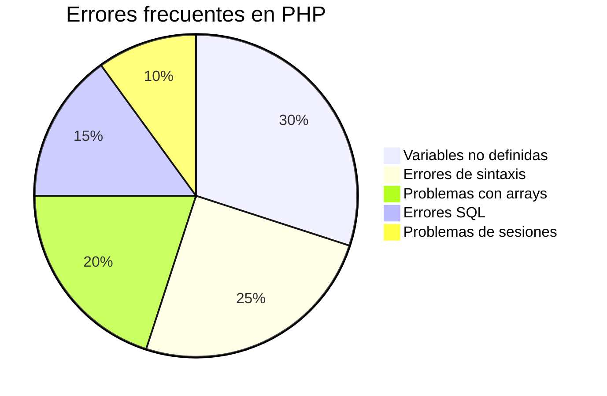
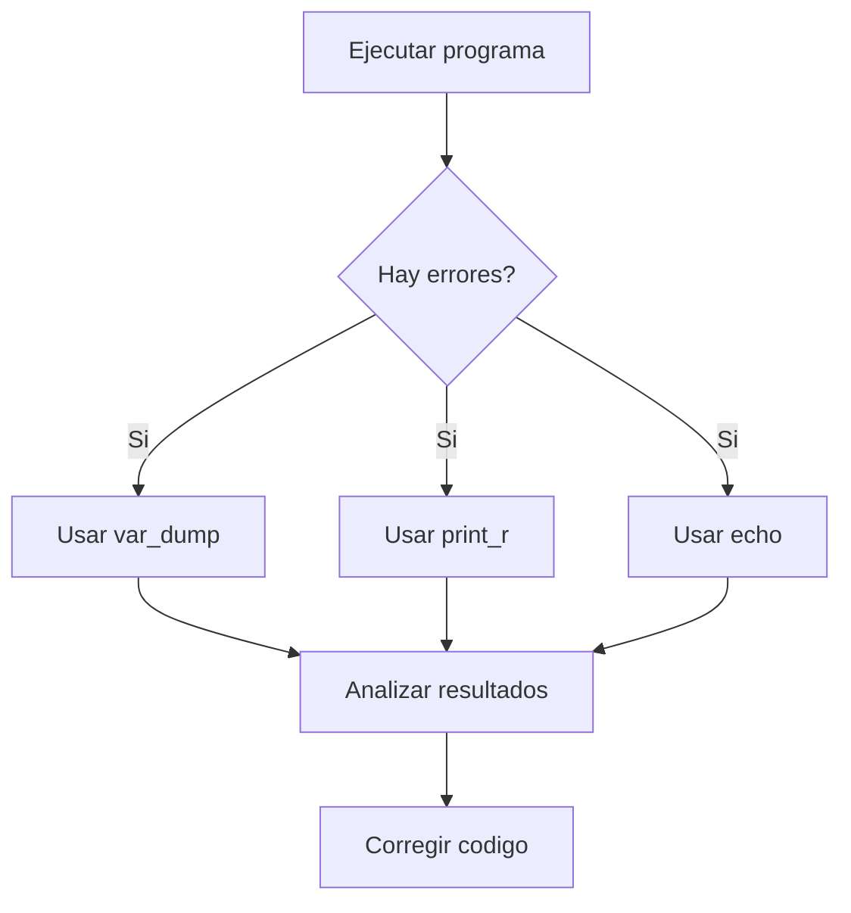

# Depuración de aplicaciones (*Debug*)

La depuración o *debugging* es el proceso de detectar, analizar y corregir errores en una aplicación durante su desarrollo.

Los errores pueden producirse por distintos motivos, como fallos de sintaxis, problemas lógicos o datos incorrectos. Para localizar estos problemas, los lenguajes y entornos de desarrollo proporcionan diferentes herramientas de depuración.



Entre las técnicas más habituales de *debug* se encuentran:

* Mostrar mensajes o valores de variables durante la ejecución.
* Utilizar herramientas de depuración integradas en el IDE.
* Revisar registros de errores (*logs*).
* Ejecutar el programa paso a paso para analizar su comportamiento.



En PHP, es posible mostrar información de depuración mediante funciones como:

???+ tip "Ejemplo Código"
    ```php
        <?php
           
           $mensaje = "Hola";
           $array = ["PHP", "Java", "Python"];

           echo $mensaje."<br>";

           echo "<pre>";
           print_r($array);
           echo "</pre>";

           var_dump($mensaje);

        ?>
    ```
