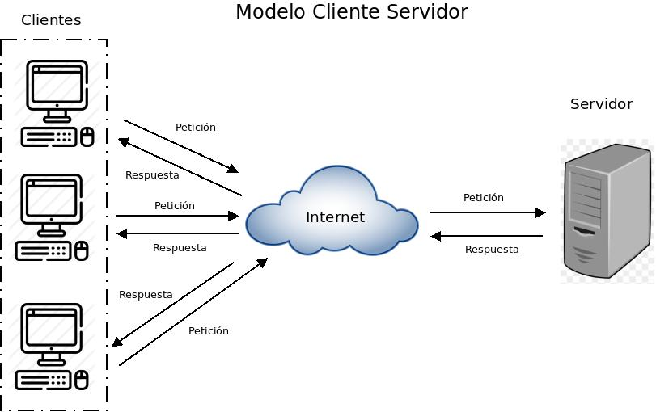

# Introducción

Introducción a la arquitectura cliente/servidor.

## Arquitectura Cliente-Servidor

En este modelo, uno o varios clientes se conectan a un servidor para solicitar recursos o servicios. En arquitecturas más modernas, el servidor único suele sustituirse por un balanceador de carga, permitiendo que varios servidores atiendan simultáneamente a múltiples clientes.

En el contexto de las aplicaciones web, el cliente corresponde al navegador web utilizado por el usuario.

El navegador realiza una solicitud (*request*), normalmente utilizando el protocolo HTTP mediante los puertos 80 o 443, y el servidor devuelve una respuesta (*response*).
